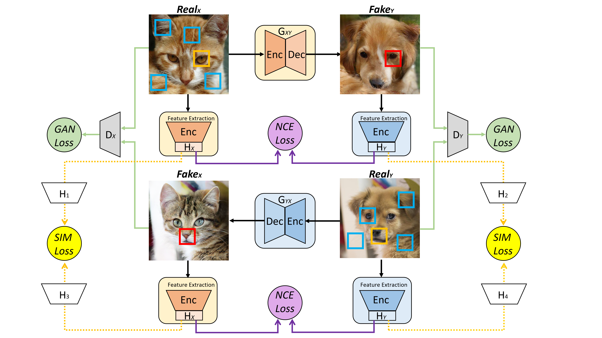
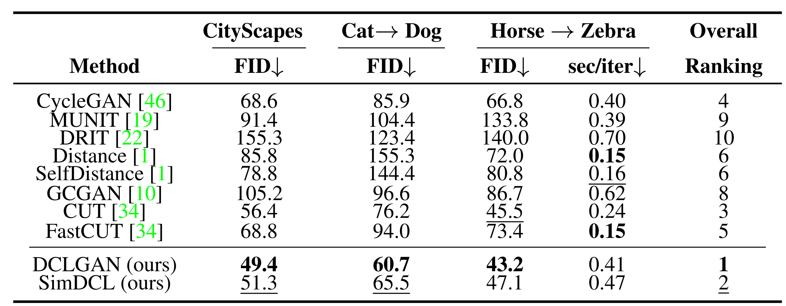
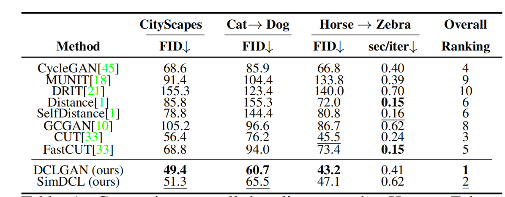

[arXiv](https://arxiv.org/abs/2104.07689)  |  [Video](https://youtu.be/w0oltXvLgmI)  |  [Slide](imgs/DCLGAN_slide.pptx)

# Dual Contrastive Learning Adversarial Generative Networks (DCLGAN)

We provide our PyTorch implementation of DCLGAN, which is a simple yet powerful model for unsupervised Image-to-image translation. Compared to CycleGAN, DCLGAN performs geometry changes with more realistic results. Compared to CUT, DCLGAN is usually more robust and achieves better performance. A viriant, SimDCL (Similarity DCLGAN) also avoids mode collapse using a new similarity loss.

DCLGAN is a general model performing ***all kinds of Image-to-Image translation tasks***. It achieves ***SOTA*** performances in most tasks that we have tested.

[Dual Contrastive Learning for Unsupervised Image-to-Image Translation](imgs/han_dualcontrastive.pdf)<br>
[Junlin Han](https://junlinhan.github.io/), Mehrdad Shoeiby, Lars Petersson, Mohammad Ali Armin<br>
DATA61-CSIRO and Australian National University<br>
In NTIRE, CVPRW 2021.
 
Our pipeline is quite straightforward. The main idea is a dual setting with two encoders to capture the variability in two distinctive domains. 


## Example Results

### Unpaired Image-to-Image Translation
Qualitative results:


Quantitative results:



More visual results:



## Prerequisites
Python 3.6 or above.

For packages, see requirements.txt.

### Getting started

- Clone this repo:
```bash
git clone https://github.com/JunlinHan/DCLGAN.git
```

- Install PyTorch 1.6 or above and other dependencies (e.g., torchvision, visdom, dominate, gputil).

  For pip users, please type the command `pip install -r requirements.txt`.

  For Conda users,  you can create a new Conda environment using `conda env create -f environment.yml`.


### DCLGAN and SimDCL Training and Test

- Download the `grumpifycat` dataset 
```bash
bash ./datasets/download_cut_dataset.sh grumpifycat
```
The dataset is downloaded and unzipped at `./datasets/grumpifycat/`.

- To view training results and loss plots, run `python -m visdom.server` and click the URL http://localhost:8097.

Train the DCL model:
```bash
python train.py --dataroot ./datasets/grumpifycat --name grumpycat_DCL 
```

Or train the SimDCL model:

```bash
python train.py --dataroot ./datasets/grumpifycat --name grumpycat_SimDCL --model simdcl
```

We also support CUT:

```bash
python train.py --dataroot ./datasets/grumpifycat --name grumpycat_cut --model cut
```

and fastCUT:

```bash
python train.py --dataroot ./datasets/grumpifycat --name grumpycat_fastcut --model fastcut
```

and CycleGAN:

```bash
python train.py --dataroot ./datasets/grumpifycat --name grumpycat_cyclegan --model cycle_gan
```

The checkpoints will be stored at `./checkpoints/grumpycat_DCL/`.

- Test the DCL model:
```bash
python test.py --dataroot ./datasets/grumpifycat --name grumpycat_DCL
```

The test results will be saved to an html file here: `./results/grumpycat_DCL/latest_test/`.

### DCLGAN, SimDCL, CUT and CycleGAN
DCLGAN is a more robust unsupervised image-to-image translation model compared to previous models. Our performance is usually better than CUT & CycleGAN.

SIMDCL is a different version, it was designed to solve mode collpase. We recommend using it for small-scale, unbalanced dataset.

### [Datasets](./docs/datasets.md)
Download CUT/CycleGAN/pix2pix datasets and learn how to create your own datasets.

Or download it here: https://people.eecs.berkeley.edu/~taesung_park/CycleGAN/datasets/.

When preparing the CityScape dataset, please use Pillow=5.0.0 to run prepare_dataset.py for consistency. 

### Apply a pre-trained DCL model and evaluate
We provide our pre-trained DCLGAN models for:

Cat <-> Dog : https://drive.google.com/file/d/1-0SICLeoySDG0q2k1yeJEI2QJvEL-DRG/view?usp=sharing

Horse <-> Zebra: https://drive.google.com/file/d/16oPsXaP3RgGargJS0JO1K-vWBz42n5lf/view?usp=sharing

CityScapes: https://drive.google.com/file/d/1ZiLAhYG647ipaVXyZdBCsGeiHgBmME6X/view?usp=sharing

Download the pre-tained model, unzip it and put it inside ./checkpoints (You may need to create checkpoints folder by yourself if you didn't run the training code).

Example usage: Download the dataset of Horse2Zebra and test the model using:

```bash
python test.py --dataroot ./datasets/horse2zebra --name horse2zebra_dcl
```

For FID score, use [pytorch-fid](https://github.com/mseitzer/pytorch-fid).

Test the FID for Horse-> Zebra:
```bash
python -m pytorch_fid ./results/horse2zebra_dcl/test_latest/images/fake_B ./results/horse2zebra_dcl/test_latest/images/real_B
```

and Zorse-> Hebra:
```bash
python -m pytorch_fid ./results/horse2zebra_dcl/test_latest/images/fake_A ./results/horse2zebra_dcl/test_latest/images/real_A
```

### Citation
If you use our code or our results, please consider citing our paper. Thanks in advance!
```
@inproceedings{han2021dcl,
  title={Dual Contrastive Learning for Unsupervised Image-to-Image Translation},
  author={Junlin Han and Mehrdad Shoeiby and Lars Petersson and Mohammad Ali Armin},
  booktitle={Proceedings of the IEEE/CVF Conference on Computer Vision and Pattern Recognition Workshops},
  year={2021}
}
```
If you use something included in CUT, you may also [CUT](https://arxiv.org/pdf/2007.15651).
```
@inproceedings{park2020cut,
  title={Contrastive Learning for Unpaired Image-to-Image Translation},
  author={Taesung Park and Alexei A. Efros and Richard Zhang and Jun-Yan Zhu},
  booktitle={European Conference on Computer Vision},
  year={2020}
}
```

### Contact
junlin.han@data61.csiro.au or junlinhcv@gmail.com

### Acknowledgments
Our code is developed based on [pytorch-CycleGAN-and-pix2pix](https://github.com/junyanz/pytorch-CycleGAN-and-pix2pix) and [CUT](http://taesung.me/ContrastiveUnpairedTranslation/). We thank the awesome work provided by CycleGAN and CUT.
We thank [pytorch-fid](https://github.com/mseitzer/pytorch-fid) for FID computation.
Great thanks to the anonymous reviewers, from both the main CVPR conference and NTIRE. They provided invaluable feedbacks and suggestions.
